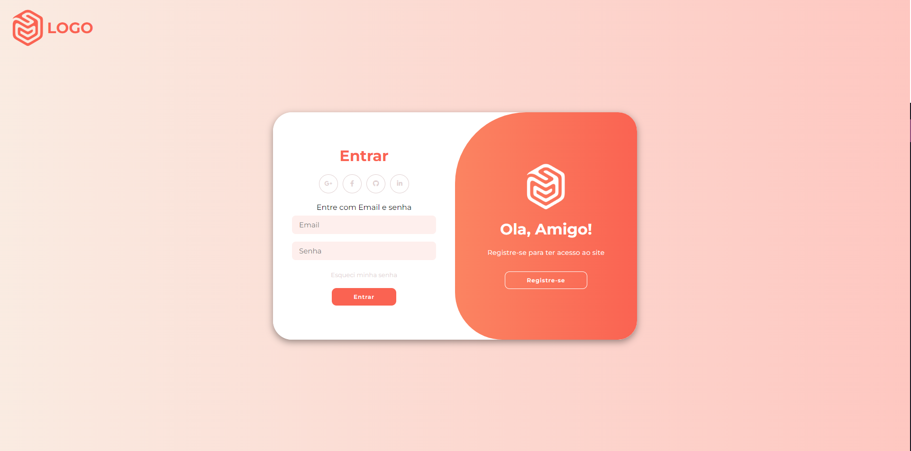
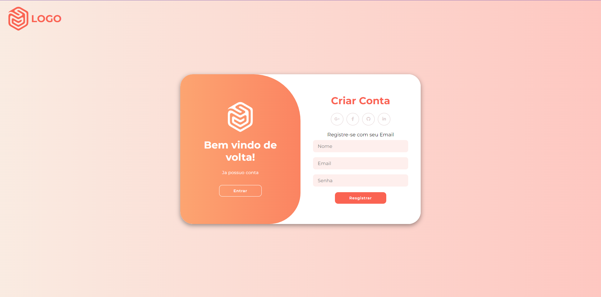
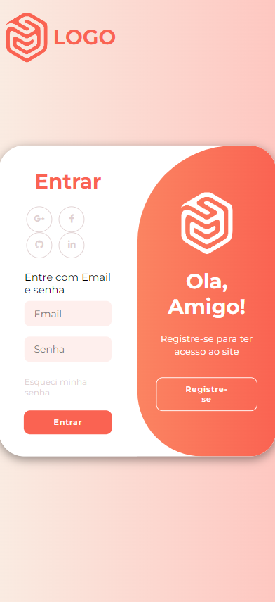

# Projeto Página de Login

## Visão Geral

Este repositório contém o código para uma página de login/registro elegante e responsiva, com efeitos de transição suaves. O objetivo é fornecer aos usuários uma experiência de autenticação agradável em diferentes dispositivos.

## Funcionalidades

- **Formulários Animados**: Transição entre os formulários de login e registro com animações para uma experiência de usuário dinâmica.
- **Opções de Login Social**: Logins rápidos de mídia social para maior conveniência do usuário.
- **Design Responsivo**: Garante que a página tenha boa aparência tanto em dispositivos móveis quanto em desktops.
- **Efeitos Interativos**: Efeitos de hover e foco para engajar os usuários.

## Pilha de Tecnologias

- HTML5
- CSS3
- JavaScript Vanilla
- Font Awesome para ícones
 
## Referência
 
Utilizei como referencia e inspiração o seguinte vídeo https://www.youtube.com/watch?v=PlpM2LJWu-s do youtuber AsmrProg

## Screnshots

### Login:

### Register:

### Mobile:

